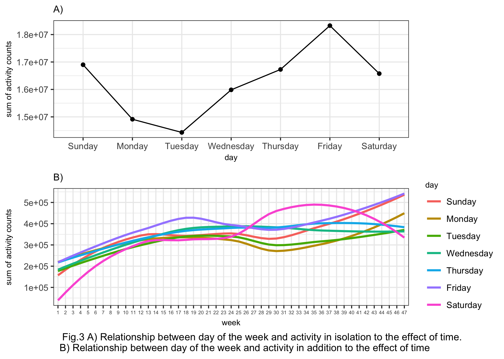
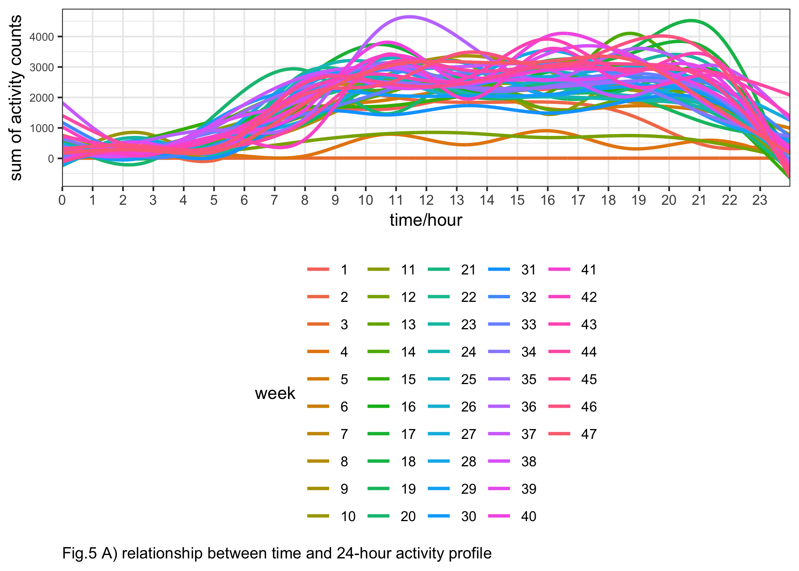
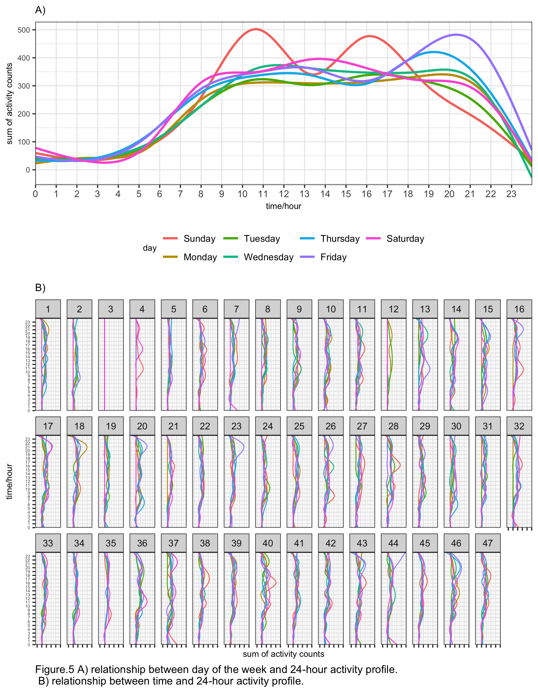

p8105\_mtp\_gw2383
================
Guojing Wu
2018/10/17

Data collection and cleaning
----------------------------

For the first step, we upload and tidy the data:

``` r
activity_df = 
  read_csv("./data/p8105_mtp_data.csv") %>% 
  janitor::clean_names() %>% 
  gather(key = act_time, value = count, activity_1:activity_1440) %>% # make it recordable
  mutate( # refactor the variables
    day = factor(day, levels = c("Sunday", "Monday", "Tuesday", "Wednesday", "Thursday", "Friday", "Saturday")), 
    week = factor(week), 
    act_time = factor((act_time), levels = paste("activity", (1:1440), sep = "_"))
    ) %>% 
  arrange(week, day) # reordering the rows by 'day' to make it more readable
```

The data is collected across 329 days (47 weeks), and each day we collected the activity data 1440 times. After tidy, we aggregate all the `activity_*` variables into one column, so now the dataset only include 4 columns: week, day, act\_time, count.

In addition, we want to check if there is any outlier, so we did boxplots across each week:

``` r
activity_df %>% 
  group_by(week, day) %>% 
  summarise(total_act = sum(count)) %>% 
  ggplot(aes(x = week, y = total_act, group = week)) +
  geom_boxplot() +
  labs(
    y = "Sum of activity counts", 
    caption = "Fig.1 boxplot for sum of each day's counts between weeks"
  ) +
  theme(
    axis.text.x = element_text(size = 5), 
    plot.caption = element_text(hjust = -0.2, size = 10)
  )
```


In Figure.1, it showed that for each week there may be several ourliers. And the whole `week 3` was collapsed into one dot, the proportion of value `1` within `week 3` is as high as 99.890873%, these could ascribe to many reasons like, the participant forgot to wear the device or the device malfunctioned in `week 3`.

Analysis based on total activity over the day
---------------------------------------------

The whole goal of this study was to figure out the patterns of physical activity over a long period. So here we want to check if time do have effect on activity.

``` r
# aggregate the count data across minutes
cross_min = activity_df %>% 
  group_by(week, day) %>% 
  summarise(sum_byday = sum(count))

ggplot(data = cross_min, aes(x = c(1:length(sum_byday)), y = sum_byday)) +
  geom_point() +
  stat_smooth(method = "lm", col = "red") +
  labs(
    x = "day", 
    y = "sum of each day's counts", 
    caption = "Fig.2 scatterplot and linear regression for sum of each day's counts between days"
  ) +
  theme(
    plot.caption = element_text(hjust = -0.2, size = 10)
    )
```


Figure.2 showed the linear regression line, the slope is positive: 573.0106366 and the p-value is very significant (2.097083710^{-11}). Which suggest that there is relationship between the total activity and day, this participant became more active over time.

Additionally, we want to check if day of the week affects total activity, so that maybe we could find some pattern across the week.

``` r
# line
in_isolation = 
  activity_df %>% 
  group_by(day) %>% 
  summarise(sum_byweek = sum(count)) %>% 
  ggplot(aes(x = day, y = sum_byweek, group = 1)) +
  geom_point() +
  geom_line() +
  labs(
    y = "sum of activity counts", 
    title = "A)"
  ) + 
  theme(title = element_text(size = 8))

in_addition = 
cross_min %>% 
  ggplot(aes(x = week, y = sum_byday, group = day, col = day)) +
  geom_smooth(se = FALSE) +
  labs(
    y = "sum of activity counts", 
    title = "B)", 
    caption = "Fig.3 A) Relationship between day of the week and activity in isolation to the effect of time.\n B) Relationship between day of the week and activity in addition to the effect of time"
  ) +
  theme(
    axis.text.x = element_text(size = 5),
    title = element_text(size = 8), 
    plot.caption = element_text(hjust = -0.2, size = 10)
  )

in_isolation / in_addition
```


In Fig.3A, we can see some fluctutation over each weekday, like the total activity reached bottom on `Tuesday` and reached its peak on `Friday`. But those weekdays' total count are in the same order of magnitude, so the differences is actually not that prominent.

24-hour profile
---------------

``` r
# distribution of the activity count by using heatmap
activity_df %>% 
  mutate(
    count = log10(count), # doing log10 transformation of the count
    format_time = factor(interaction(week, day), levels = paste(rep(1:47, each = 7), c("Sunday", "Monday", "Tuesday", "Wednesday", "Thursday", "Friday", "Saturday"), sep = ".")) # relevel eachday, so it ranked properly
    ) %>% 
  ggplot(aes(x = act_time, y = format_time, fill = count)) +
  geom_tile() +
  scale_fill_gradient(low = "white", high = "steelblue") +
  guides(fill = guide_legend(title = "log10(count)")) +
  scale_x_discrete( # rename the x axis label
    breaks = paste("activity", (0:23)*60 + 1, sep = "_"), 
    labels = c(0:23), 
    name = "time/hour"
    ) +
  scale_y_discrete( # rename the y axis label
    breaks = paste(1:47, "Sunday", sep = "."), 
    labels = c((0:46) * 7 + 1), 
    name = "day"
  ) +
  geom_vline(xintercept = 7*60, col = "red") + # an vertical line at 7 o'clock
  geom_vline(xintercept = 23*60, col = "red") + # an vertical line at 23 o'clock
  labs(
    caption = "Fig.4 heatmap for 24-hour activity \"profiles\" for each day"
  ) +
  theme(
    axis.text.y = element_text(size = 7),
    plot.caption = element_text(hjust = 0, size = 10)
  )
```



Here we can see that in general, the participant's avtive time is around `7:00 - 23:00`, and his inactive time is around `23:00 - 7:00`.

24-hour activity profile (time effect)

``` r
activity_df %>%
  group_by(week, act_time) %>%
  summarise(sum_byweekday = sum(count)) %>%
  ggplot(aes(x = act_time, y = sum_byweekday, group = week, color = week)) +
  geom_smooth(se = FALSE) +
  scale_x_discrete( # rename the x axis label
    breaks = paste("activity", (0:23)*60 + 1, sep = "_"),
    labels = c(0:23),
    name = "time/hour"
    ) +
  labs(
    y = "sum of activity counts",
    caption = "Fig.5 A) relationship between time and 24-hour activity profile"
  ) +
  theme(
    axis.text.y = element_text(size = 7),
    plot.caption = element_text(hjust = 0, size = 10), 
    legend.position = "bottom"
  )
```



24-hour activity profile (day of the week effect)

``` r
activity_df %>% 
  group_by(day, act_time) %>% 
  summarise(sum_byweekday = sum(count)) %>% 
  ggplot(aes(x = act_time, y = sum_byweekday, group = day, color = day)) +
  geom_smooth(se = FALSE) +
  scale_x_discrete( # rename the x axis label
    breaks = paste("activity", (0:23)*60 + 1, sep = "_"), 
    labels = c(0:23), 
    name = "time/hour"
    ) +
  labs(
    y = "sum of activity counts",
    caption = "Fig.5 B) relationship between day of the week and 24-hour activity profile"
  ) +
  theme(
    axis.text.y = element_text(size = 7),
    plot.caption = element_text(hjust = 0, size = 10)
  )
```

    ## `geom_smooth()` using method = 'gam' and formula 'y ~ s(x, bs = "cs")'



Here we can see `Friday night` and `Sunday afternoon` are different from the other five days, the total activity counts are higher and have greater fluctuation.
