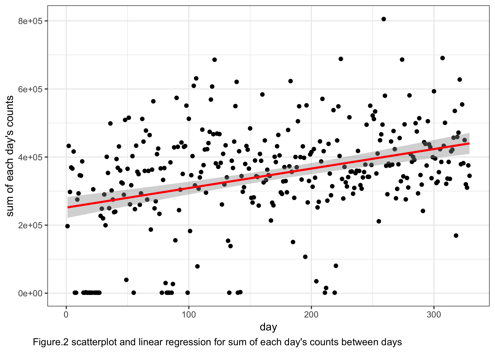

p8105\_mtp\_gw2383
================
Guojing Wu
2018/10/17

-   [read and tidy data](#read-and-tidy-data)
-   [activity over time](#activity-over-time)
-   [24-hour profile](#hour-profile)

read and tidy data
------------------

``` r
# change rhe cache parameter!!!!

activity_df = 
  read_csv("./data/p8105_mtp_data.csv") %>% 
  janitor::clean_names() %>% 
  gather(key = act_time, value = count, activity_1:activity_1440) %>% # make it recordable
  mutate( # refactor the variables
    day = factor(day, levels = c("Sunday", "Monday", "Tuesday", "Wednesday", "Thursday", "Friday", "Saturday")), 
    week = factor(week), 
    act_time = factor((act_time), levels = paste("activity", (1:1440), sep = "_"))
    ) %>% 
  arrange(week, day) # reordering the rows by 'day' to make it more readable
```

the data is collected across 329 days (47 weeks), and each day we collected the activity data 1440 times.

A boxplot: distribution over each week:

``` r
activity_df %>% 
  group_by(week, day) %>% 
  summarise(total_act = sum(count)) %>% 
  ggplot(aes(x = week, y = total_act, group = week)) +
  geom_boxplot() +
  labs(
    y = "Sum of activity counts", 
    caption = "Fig.1 boxplot for sum of each day's counts between weeks"
  ) +
  theme(
    axis.text.x = element_text(size = 5), 
    plot.caption = element_text(hjust = -0.2, size = 10)
  )
```


Here we can see that for each week there are some ourliers. And the whole `week 3` was collapsed into one dot, the proportion of value `1` within `week 3` is as high as 99.890873%.

activity over time
------------------

``` r
# aggregate the count data across minutes
cross_min = activity_df %>% 
  group_by(week, day) %>% 
  summarise(sum_byday = sum(count))

ggplot(data = cross_min, aes(x = c(1:length(sum_byday)), y = sum_byday)) +
  geom_point() +
  stat_smooth(method = "lm", col = "red") +
  labs(
    x = "day", 
    y = "sum of each day's counts", 
    caption = "Fig.2 scatterplot for sum of each day's counts between days"
  ) +
  theme(
    plot.caption = element_text(hjust = -0.2, size = 10)
    )
```



Here we can see the linear regression line, the slope is positive: 573.0106366 and the p-value is very significant (2.097083710^{-11}). Which suggest that this participant became more active over time.

Is day of the week affects the activity?(in isolation and in additon to the effect of time)

``` r
# line
in_isolation = 
  activity_df %>% 
  group_by(day) %>% 
  summarise(sum_byweek = sum(count)) %>% 
  ggplot(aes(x = day, y = sum_byweek, group = 1)) +
  geom_point() +
  geom_line() +
  labs(
    y = "sum of activity counts", 
    title = "A)"
  ) + 
  theme(title = element_text(size = 8))

in_addition = 
cross_min %>% 
  ggplot(aes(x = week, y = sum_byday, group = day, col = day)) +
  geom_smooth(se = FALSE) +
  labs(
    y = "sum of activity counts", 
    title = "B)", 
    caption = "Fig.3 A) Relationship between day of the week and activity in isolation to the effect of time.\n B) Relationship between day of the week and activity in addition to the effect of time"
  ) +
  theme(
    axis.text.x = element_text(size = 5),
    title = element_text(size = 8), 
    plot.caption = element_text(hjust = -0.2, size = 10)
  )

in_isolation / in_addition
```


24-hour profile
---------------

``` r
# distribution of the activity count by using heatmap
activity_df %>% 
  mutate(
    count = log10(count), # doing log10 transformation of the count
    format_time = factor(interaction(week, day), levels = paste(rep(1:47, each = 7), c("Sunday", "Monday", "Tuesday", "Wednesday", "Thursday", "Friday", "Saturday"), sep = ".")) # relevel eachday, so it ranked properly
    ) %>% 
  ggplot(aes(x = act_time, y = format_time, fill = count)) +
  geom_tile() +
  scale_fill_gradient(low = "white", high = "steelblue") +
  guides(fill = guide_legend(title = "log10(count)")) +
  scale_x_discrete( # rename the x axis label
    breaks = paste("activity", (0:23)*60 + 1, sep = "_"), 
    labels = c(0:23), 
    name = "time/hour"
    ) +
  scale_y_discrete( # rename the y axis label
    breaks = paste(1:47, "Sunday", sep = "."), 
    labels = c((0:46) * 7 + 1), 
    name = "day"
  ) +
  geom_vline(xintercept = 7*60, col = "red") + # an vertical line at 7 o'clock
  geom_vline(xintercept = 23*60, col = "red") + # an vertical line at 23 o'clock
  labs(
    caption = "Fig.4 heatmap for 24-hour activity \"profiles\" for each day"
  ) +
  theme(
    axis.text.y = element_text(size = 7),
    plot.caption = element_text(hjust = 0, size = 10)
  )
```


Here we can see that in general, the participant's avtive time is around `7:00 - 23:00`, and his inactive time is around `23:00 - 7:00`.

24-hour activity profile (time effect)

``` r
activity_df %>%
  group_by(week, act_time) %>%
  summarise(sum_byweekday = sum(count)) %>%
  ggplot(aes(x = act_time, y = sum_byweekday, group = week, color = week)) +
  geom_smooth(se = FALSE) +
  scale_x_discrete( # rename the x axis label
    breaks = paste("activity", (0:23)*60 + 1, sep = "_"),
    labels = c(0:23),
    name = "time/hour"
    ) +
  labs(
    y = "sum of activity counts",
    caption = "Fig.5 A) relationship between time and 24-hour activity profile"
  ) +
  theme(
    axis.text.y = element_text(size = 7),
    plot.caption = element_text(hjust = 0, size = 10), 
    legend.position = "bottom"
  )
```


24-hour activity profile (day of the week effect)

``` r
activity_df %>% 
  group_by(day, act_time) %>% 
  summarise(sum_byweekday = sum(count)) %>% 
  ggplot(aes(x = act_time, y = sum_byweekday, group = day, color = day)) +
  geom_smooth(se = FALSE) +
  scale_x_discrete( # rename the x axis label
    breaks = paste("activity", (0:23)*60 + 1, sep = "_"), 
    labels = c(0:23), 
    name = "time/hour"
    ) +
  labs(
    y = "sum of activity counts",
    caption = "Fig.5 B) relationship between day of the week and 24-hour activity profile"
  ) +
  theme(
    axis.text.y = element_text(size = 7),
    plot.caption = element_text(hjust = 0, size = 10)
  )
```

    ## `geom_smooth()` using method = 'gam' and formula 'y ~ s(x, bs = "cs")'


Here we can see `Friday night` and `Sunday afternoon` are different from the other five days, the total activity counts are higher and have greater fluctuation.
