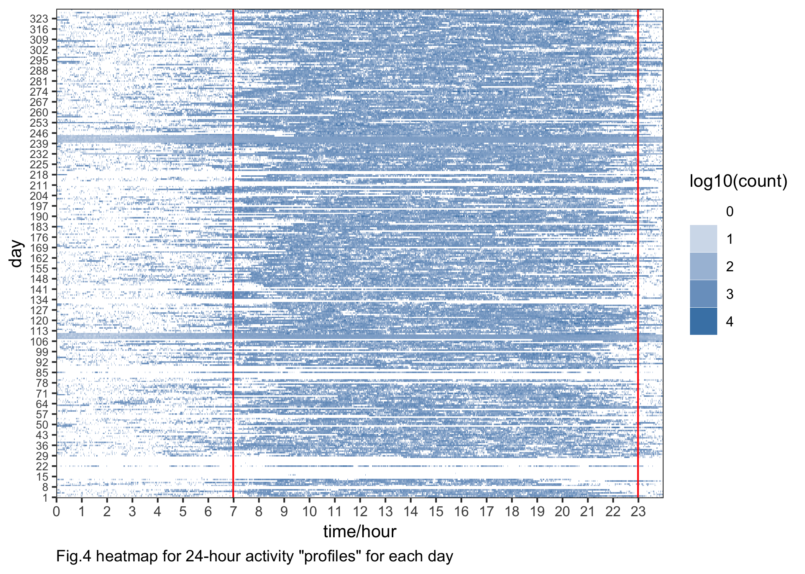

p8105\_mtp\_gw2383
================
Guojing Wu
2018/10/17

-   [read and tidy data](#read-and-tidy-data)
-   [activity over time](#activity-over-time)

read and tidy data
------------------

``` r
# change rhe cache parameter!!!!
# is format_time necessary?

activity_df = 
  read_csv("./data/p8105_mtp_data.csv") %>% 
  janitor::clean_names() %>% 
  gather(key = act_time, value = count, activity_1:activity_1440) %>% # make it recordable
  mutate(
    day = factor(day, levels = c("Sunday", "Monday", "Tuesday", "Wednesday", "Thursday", "Friday", "Saturday")), 
    week = factor(week)) %>% 
  arrange(week, day) # reordering the rows by 'day' to make it more readable
```

the data is collected across 329 days (47 weeks), and each day we collected the activity data 1440 times.

<!--
A spaghetti plot: total_count over each week:


```r
activity_df %>%
  group_by(week, day) %>%
  summarise(total_act = sum(count)) %>%
  ggplot(aes(x = day, y = total_act, group = week, color = as.character(week))) +
  scale_y_log10() +
  geom_line()
```


-->
A boxplot: distribution over each week:

``` r
activity_df %>% 
  group_by(week, day) %>% 
  summarise(total_act = sum(count)) %>% 
  ggplot(aes(x = week, y = total_act, group = week)) +
  geom_boxplot() +
  labs(
    y = "Sum of activity counts", 
    title = "boxplot for sum of each day's counts between weeks"
  )
```


Here we can see that for each week there are some ourliers. And the whole `week 3` was collapsed into one dot, the proportion of value `1` within `week 3` is as high as 99.890873%.

activity over time
------------------

``` r
# aggregate the count data across minutes
cross_min = activity_df %>% 
  group_by(week, day) %>% 
  summarise(sum_byday = sum(count))

ggplot(data = cross_min, aes(x = c(1:length(sum_byday)), y = sum_byday)) +
  geom_point() +
  stat_smooth(method = "lm", col = "red") +
  labs(
    x = "day", 
    y = "sum of each day's counts", 
    title = "scatterplot for sum of each day's counts between days"
  )
```


Here we can see the linear regression line, the slope is positive: 573.0106366 and the p-value is very significant (2.097083710^{-11}). Which suggest that this participant became more active over time.

Is day of the week affects the activity?(in isolation and in additon to the effect of time)

``` r
# line
in_isolation = 
  activity_df %>% 
  group_by(day) %>% 
  summarise(sum_byweek = sum(count)) %>% 
  ggplot(aes(x = day, y = sum_byweek, group = 1)) +
  geom_point() +
  geom_line() +
  labs(
    y = "sum of activity counts", 
    title = "sum of each weekday's counts in isolation to the effect of time"
  )

in_addition = 
cross_min %>% 
  ggplot(aes(x = week, y = sum_byday, group = day, col = day)) +
  geom_smooth(se = FALSE) +
  labs(
    y = "sum of activity counts in addition to the effect of time"
  )

in_isolation / in_addition
```



<!-- ```{r, dpi = 300, out.width = "90%"} -->
<!-- # boxplot -->
<!-- activity_df %>%  -->
<!--   ggplot(aes(x = day, y = count, group = day)) + -->
<!--   geom_boxplot() + -->
<!--   scale_y_log10() + -->
<!--   labs( -->
<!--     y = "sum of activity counts",  -->
<!--     title = "sum of each weekday's counts" -->
<!--   ) -->
<!-- ``` -->
