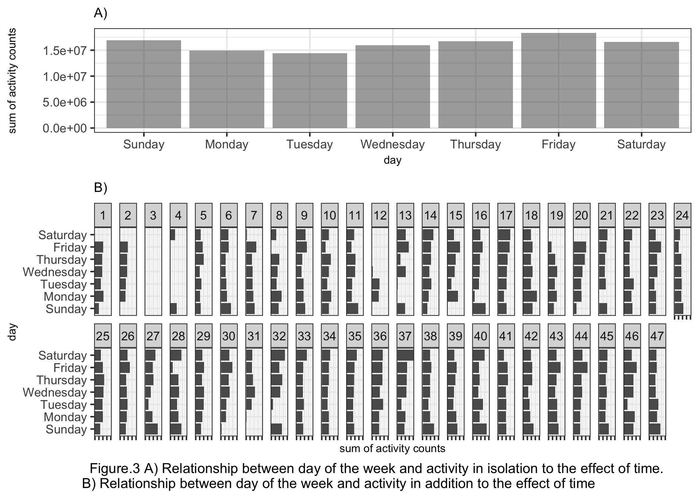

p8105\_mtp\_gw2383
================
Guojing Wu
2018/10/17

Data collection and cleaning
----------------------------

First we upload and tidy the data:

``` r
# upload and tidy data
activity_df = 
  read_csv("./data/p8105_mtp_data.csv") %>% 
  janitor::clean_names() %>% 
  gather(key = act_time, value = count, activity_1:activity_1440) %>% # make it recordable
  mutate( # refactor the variables
    day = factor(day, levels = c("Sunday", "Monday", "Tuesday", "Wednesday", "Thursday", "Friday", "Saturday")), 
    week = factor(week), 
    act_time = factor((act_time), levels = paste("activity", (1:1440), sep = "_"))
    ) %>% 
  arrange(week, day) # reordering the rows by 'day' to make it more readable
```

The data is collected across 329 days (47 weeks), and each day we collected the activity data 1440 times. After tidy, we aggregate all the `activity_*` variables into one column, so now the dataset only include 4 columns: week, day, act\_time, count.

In addition, we want to check if there is any outlier:

``` r
activity_df %>% 
  group_by(week, day) %>% 
  summarise(total_act = sum(count)) %>% 
  ggplot(aes(x = week, y = total_act, group = week)) +
  geom_boxplot() +
  labs(
    y = "Sum of activity counts", 
    caption = "Figure.1 boxplot for sum of each day's counts between weeks"
  ) +
  theme(
    axis.text.x = element_text(size = 5), 
    plot.caption = element_text(hjust = -0.2, size = 10)
  )
```


In Fig.1, it showed that there are several ourliers each week. And the whole `week 3` was collapsed into one dot, the proportion of value `1` within `week 3` is as high as 99.890873%, these could ascribe to many reasons like, the participant forgot to wear the device or the device malfunctioned, etc.

Analysis based on total activity over the day
---------------------------------------------

The whole goal of this study was to figure out the patterns of physical activity over a long period. So here we want to find out whether time has effect on activity.

``` r
# aggregate the count data across minutes
cross_min = activity_df %>% 
  group_by(week, day) %>% 
  summarise(sum_byday = sum(count))

ggplot(data = cross_min, aes(x = c(1:length(sum_byday)), y = sum_byday)) +
  geom_point() +
  stat_smooth(method = "lm", col = "red") +
  labs(
    x = "day", 
    y = "sum of each day's counts", 
    caption = "Figure.2 scatterplot and linear regression for sum of each day's counts between days"
  ) +
  theme(
    plot.caption = element_text(hjust = -0.2, size = 10)
    )
```


Fig.2 showed the linear regression line and corresponding 95% CI, the slope is positive: 573.0106366 (p.value = 2.097083710^{-11}), we then concluded that this participant became more and more active over time.

Additionally, we also tried to figure our if day of the week affects total activity:

``` r
# in isolation to the effect of time
in_isolation = 
  activity_df %>% 
  group_by(day) %>% 
  summarise(sum_byweek = sum(count)) %>% 
  ggplot(aes(x = day, y = sum_byweek, group = 1, alpha = 0.7)) +
  geom_bar(stat = "identity") +
  labs(
    y = "sum of activity counts", 
    title = "A)"
  ) + 
  theme(
    title = element_text(size = 8), 
    legend.position = "none"
    )

# in addition to the effect of time
in_addition = 
  cross_min %>% 
  ggplot(aes(x = day, y = sum_byday, group = 1)) +
  geom_bar(stat = "identity") +
  coord_flip() +
  labs(
    x = "day", 
    y = "sum of activity counts", 
    title = "B)", 
    caption = "Figure.3 A) Relationship between day of the week and activity in isolation to the effect of time.\n B) Relationship between day of the week and activity in addition to the effect of time"
  ) +
  facet_wrap(~week, nrow = 2) +
  theme(
    axis.text.x = element_blank(), 
    title = element_text(size = 8), 
    plot.caption = element_text(hjust = -0.2, size = 10)
  )

in_isolation + in_addition + plot_layout(ncol = 1, heights = c(1:2))
```



In Fig.3A, we can see some fluctuations over each weekday, like, the total activity reached bottom on `Tuesday` and reached peak on `Friday`. But actually, those weekdays' total count are in the same order of magnitude, therefore we used `ANOVA` to give a more accurate test. The null hypothesis is:

-   *day of the week doesn't affect activity, or there is no difference between the mean of sum of activity across each weekday*

``` r
lm(cross_min$sum_byday ~ cross_min$day) %>% 
  anova() %>% 
  knitr::kable(digits = 2)
```

|                |   Df|        Sum Sq|      Mean Sq|  F value|  Pr(&gt;F)|
|----------------|----:|-------------:|------------:|--------:|----------:|
| cross\_min$day |    6|  2.174223e+11|  36237048620|     1.58|       0.15|
| Residuals      |  322|  7.369946e+12|  22888030957|       NA|         NA|

Because *p*.*v**a**l**u**e* ≥ 0.05, we conclude that day of the week (in isolation to the effect of time) doesn't affect activity. In Fig.3B, we add the effect of time, and it shows that within each week, there is also some fluctuation between weekdays. But still, counts are in the same order of magnitude, therefore we used the `ANOVA` again to test the null hypothesis that:

-   *time doesn't affect activity, or there is no difference between the mean of sum of activity across each time*

``` r
lm(cross_min$sum_byday ~ cross_min$week) %>% 
  anova() %>% 
  knitr::kable(digits = 2)
```

|                 |   Df|        Sum Sq|      Mean Sq|  F value|  Pr(&gt;F)|
|-----------------|----:|-------------:|------------:|--------:|----------:|
| cross\_min$week |   46|  2.797702e+12|  60819603775|     3.58|          0|
| Residuals       |  282|  4.789666e+12|  16984632930|       NA|         NA|

Because *p*.*v**a**l**u**e* ≤ 0.05, we conclude that the effect of time (week specifically) affects activity.

24-hour profile
---------------

We used heatmap for 24-hour activity profiles:

``` r
# distribution of the activity count by using heatmap
activity_df %>% 
  mutate(
    count = log10(count), # doing log10 transformation of the count
    format_time = factor(interaction(week, day), levels = paste(rep(1:47, each = 7), c("Sunday", "Monday", "Tuesday", "Wednesday", "Thursday", "Friday", "Saturday"), sep = ".")) # relevel eachday, so it ranked properly
    ) %>% 
  ggplot(aes(x = act_time, y = format_time, fill = count)) +
  geom_tile() +
  scale_fill_gradient(low = "white", high = "steelblue") +
  guides(fill = guide_legend(title = "log10(count)")) +
  scale_x_discrete( # rename the x axis label
    breaks = paste("activity", (0:23)*60 + 1, sep = "_"), 
    labels = c(0:23), 
    name = "time/hour"
    ) +
  scale_y_discrete( # rename the y axis label
    breaks = paste(1:47, "Sunday", sep = "."), 
    labels = c((0:46) * 7 + 1), 
    name = "day"
  ) +
  geom_vline(xintercept = 7*60, col = "red", alpha = 0.6) + # an vertical line at 7 o'clock
  geom_vline(xintercept = 23*60, col = "red", alpha = 0.6) + # an vertical line at 23 o'clock
  labs(
    caption = "Figure.4 heatmap for 24-hour activity \"profiles\" for each day"
  ) +
  theme(
    axis.text.y = element_text(size = 7),
    plot.caption = element_text(hjust = 0, size = 10)
  )
```


Fig.4 showed that in general, the participant's avtive time is around `7:00 - 23:00`, and his inactive time is around `23:00 - 7:00`.

We then try to test if day of the week and time affect activity:

``` r
# day of the week effect
day_of_week = 
  activity_df %>% 
  group_by(day, act_time) %>% 
  summarise(sum_byweekday = mean(count)) %>% # using mean instead of sum to estimate
  ggplot(aes(x = act_time, y = sum_byweekday, group = day, color = day)) +
  geom_smooth(se = FALSE) +
  scale_x_discrete( # rename the x axis label
    breaks = paste("activity", (0:23)*60 + 1, sep = "_"), 
    labels = c(0:23), 
    name = "time/hour"
    ) +
  labs(
    y = "sum of activity counts",
    title = "A)"
  ) +
  theme(
    axis.text.y = element_text(size = 7),
    title = element_text(size = 8), 
    plot.caption = element_text(hjust = 0, size = 10), 
    legend.position = "bottom"
  )

# time effect
effect_of_time = 
  activity_df %>%
  ggplot(aes(x = act_time, y = count, group = day, color = day)) +
  geom_smooth(se = FALSE, size = 0.4) +
  scale_x_discrete( # rename the x axis label
    breaks = paste("activity", (0:23)*60 + 1, sep = "_"),
    labels = c(0:23),
    name = "time/hour"
    ) +
  coord_flip() +
  facet_wrap(~week, nrow = 3) +
  labs(
    y = "sum of activity counts",
    title = "B)", 
    caption = "Figure.5 A) relationship between day of the week and 24-hour activity profile.\n B) relationship between time and 24-hour activity profile."
  ) +
  theme(
    axis.text.x = element_blank(), 
    axis.text.y = element_text(size = 4), 
    title = element_text(size = 8), 
    plot.caption = element_text(hjust = 0, size = 10), 
    legend.position = "none"
  )

day_of_week + effect_of_time + plot_layout(ncol = 1, heights = c(1:8))
```


Fig.5A showed that `Friday night` and `Sunday afternoon` are different from the other five days, the total activity counts are higher and have greater fluctuations. Fig.5B showed to us that when following the time through 47 weeks, each week's profile varies and usually `Sunday` and `Friday` are the most prominent among other weekdays.
